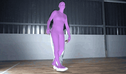
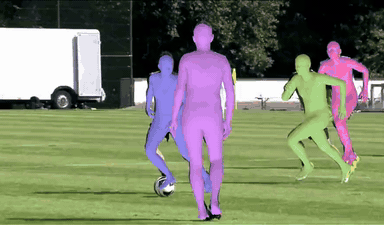
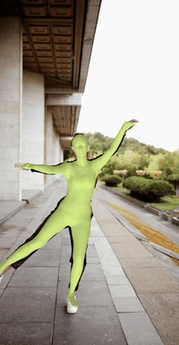
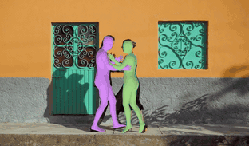

# CoMotion: Concurrent Multi-person 3D Motion

This software project accompanies the research paper:
**[CoMotion: Concurrent Multi-person 3D Motion](https://openreview.net/forum?id=qKu6KWPgxt)**,
_Alejandro Newell, Peiyun Hu, Lahav Lipson, Stephan R. Richter, and Vladlen Koltun_.

<div style="display: flex; justify-content: space-around;">
  
  
  
</div>

<div style="display: flex; justify-content: space-around;">
  
  
  
</div>

We introduce CoMotion, an approach for detecting and tracking detailed 3D poses of multiple people from a single monocular camera stream. Our system maintains temporally coherent predictions in crowded scenes filled with difficult poses and occlusions. Our model performs both strong per-frame detection and a learned pose update to track people from frame to frame. Rather than match detections across time, poses are updated directly from a new input image, which enables online tracking through occlusion.

The code in this directory provides helper functions and scripts for inference and visualization.

## Getting Started

### Installation

```bash
conda create -n comotion -y python=3.10
conda activate comotion
pip install -e '.[all]'
```

### Download models

To download pretrained checkpoints, run:

```bash
bash get_pretrained_models.sh
```

Checkpoint data will be downloaded to `src/comotion_demo/data`. You will find pretrained weights for the detection stage which includes the main vision backbone (`comotion_detection_checkpoint.pt`), as well as a separate checkpoint for the update stage (`comotion_refine_checkpoint.pt`). You can use the detection stage standalone for single-image multiperson pose estimation.

For MacOS, we provide a pre-compiled `coreml` version of the detection stage of the model which offers significant speedups when running locally on a personal device.

### Download SMPL body model

In order to run CoMotion and the corresponding visualization, the neutral SMPL body model is required. Please go to the [SMPL website](https://smpl.is.tue.mpg.de/) and follow the provided instructions to download the model (version 1.1.0). After downloading, copy `basicmodel_neutral_lbs_10_207_0_v1.1.0.pkl` to `src/comotion_demo/data/smpl/SMPL_NEUTRAL.pkl` (we rename the file to be compatible with the visualization library `aitviewer`).

### Run CoMotion

We provide a demo script that takes either a video file or a directory of images as input. To run it, call:

```bash
python demo.py -i path/to/video.mp4 -o results/
```

Optional arguments include `--start-frame` and `--num-frames` to select subsets of the video to run on. The network will save a `.pt` file with all of the detected SMPL pose parameters as well as a rendered `.mp4` with the predictions overlaid on the input video. We also automatically produce a `.txt` file in the `MOT` format with bounding boxes compatible with most standard tracking evaluation code. If you wish to skip the visualization, add the command `--skip-visualization`.

The demo code supports running on a single image as well, which the code will infer automatically if the input path provided has a `.png` or `.jpeg/.jpg` suffix:

```bash
python demo.py -i path/to/image.jpg -o results/
```

In this case, we save a `.pt` file with the detected SMPL poses as well as 2D and 3D coordinates and confidences associated with each detection.

> [!TIP]
>
> - If you encounter an error that `libc++.1.dylib` is not found, resolve it with `conda install libcxx`.
> - For headless rendering on a remote server, you may encounter an error like `XOpenDisplay: cannot open display`. In this case start a virtual display using `Xvfb :0 -screen 0 640x480x24 & export DISPLAY=:0.0`. You may need to install `xvfb` first (`apt install xvfb`).

## Citation

If you find our work useful, please cite the following paper:

```bibtex
@inproceedings{newell2025comotion,
  title      = {CoMotion: Concurrent Multi-person 3D Motion},
  author     = {Alejandro Newell and Peiyun Hu and Lahav Lipson and Stephan R. Richter and Vladlen Koltun},
  booktitle  = {International Conference on Learning Representations},
  year       = {2025},
  url        = {https://openreview.net/forum?id=qKu6KWPgxt},
}
```

## License

This sample code is released under the [LICENSE](LICENSE.md) terms.

The model weights are released under the [MODEL LICENSE](LICENSE_MODEL.md) terms.

## Acknowledgements

Our codebase is built using multiple open source contributions, please see [Acknowledgements](ACKNOWLEDGEMENTS.md) for more details.

Please check the paper for a complete list of references and datasets used in this work.
